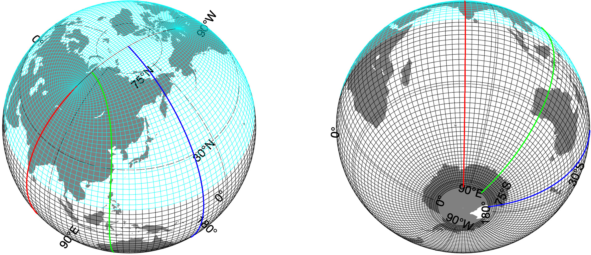
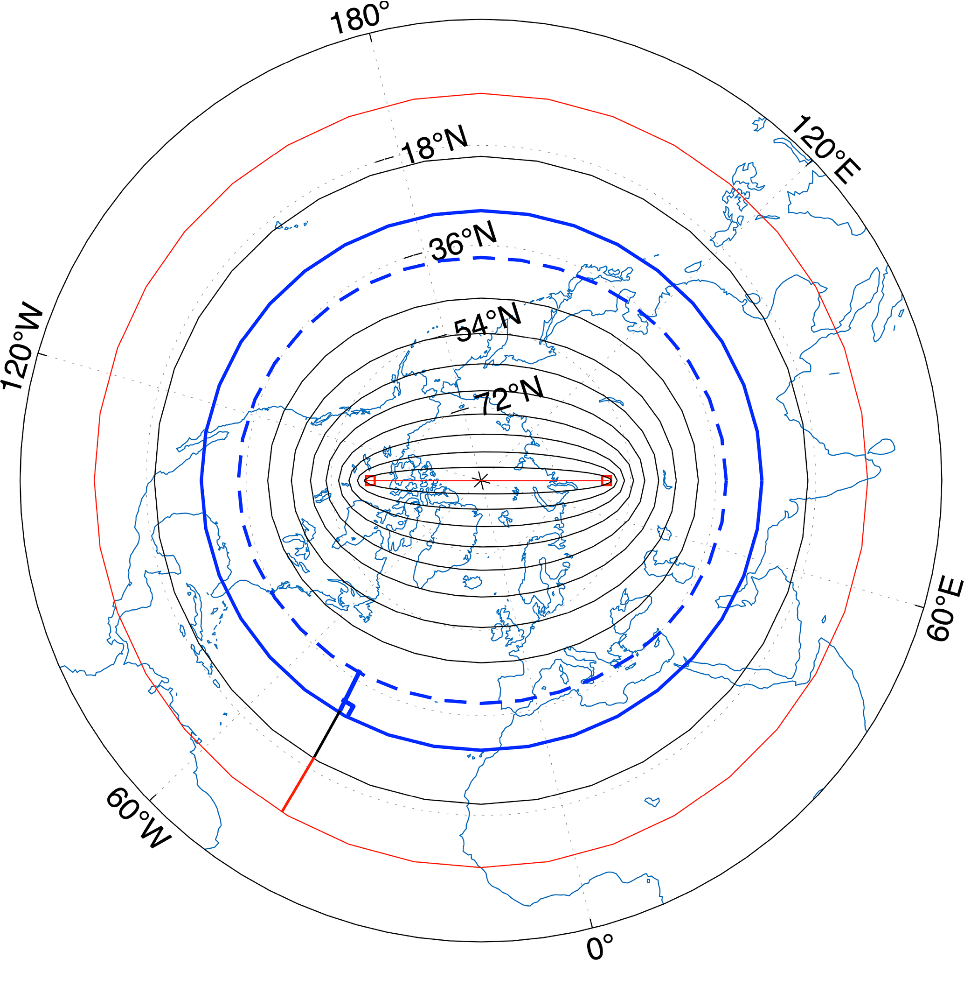

# TS grids – a tripolar grid hierarchy

## Setup
### Dependencies
* m-map (v1.4)

## How to make a POP grid

res = 1;
PLOT = 1;

info = make_global_grid_B(res,PLOT);

info.Z = generate_Z_from_POP(info.tlats,info.tlons);
info.kmt = locate_pop_kmt(info.Z,60);

## Example

Fig 1. Global tripolar TS grid with the northern patch (in cyan) and southern patch (in black).

Fig 2. Construction of the embedding ellipses and the orthogonal grid.
